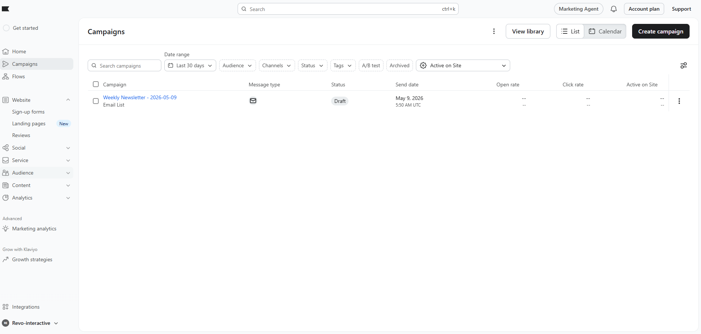
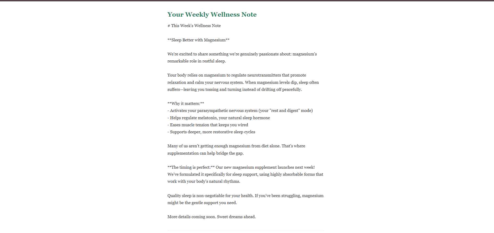
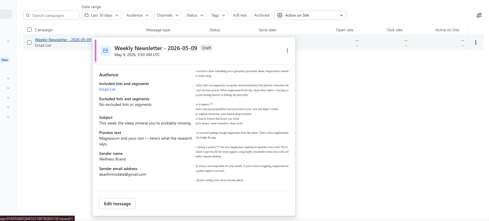

# Claude + Klaviyo Newsletter Automation

Automated pipeline that generates weekly newsletter copy via the Anthropic Claude API 
and creates a scheduled campaign in Klaviyo — zero manual input required.

## Stack
- Python, Anthropic Claude API (claude-haiku), Klaviyo REST API v2024-02-15

## Flow
Weekly brief → Claude generates copy → HTML template created → 
Klaviyo campaign created → template assigned → ready to send

## Demo Output

Script was tested end-to-end. Below is the Klaviyo dashboard showing 
campaigns created automatically via the API pipeline:

### Sample Generated Emails

